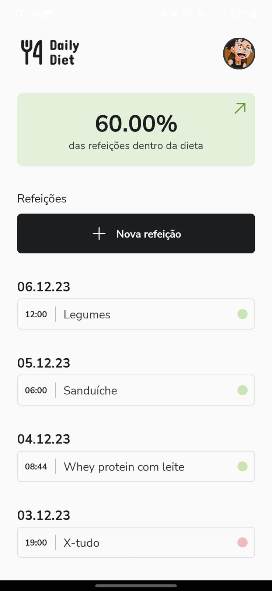
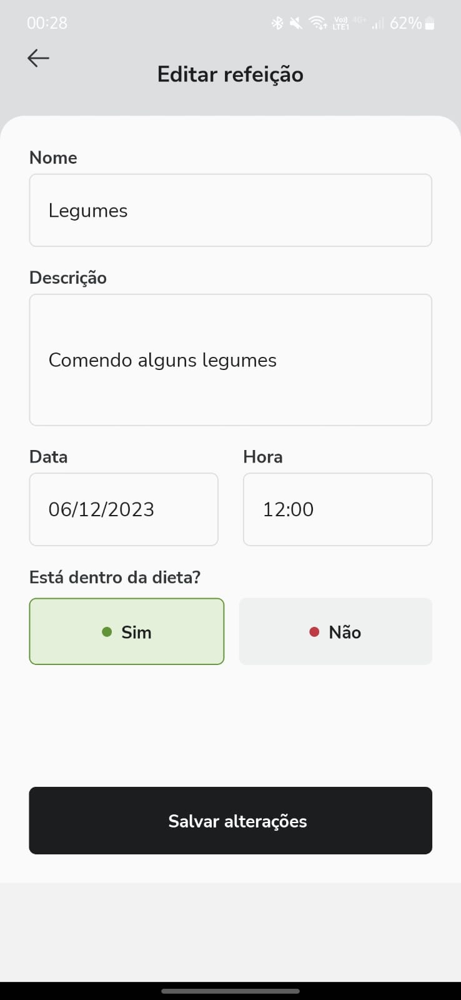
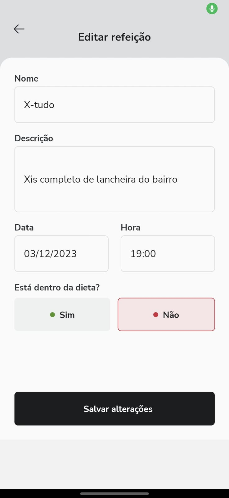
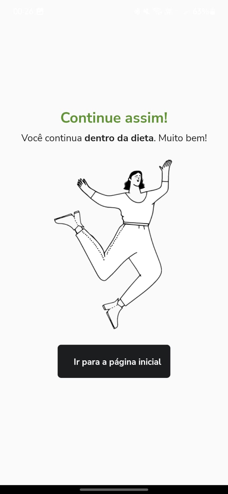
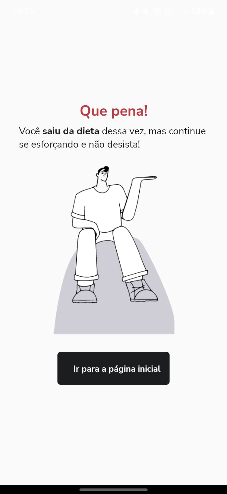
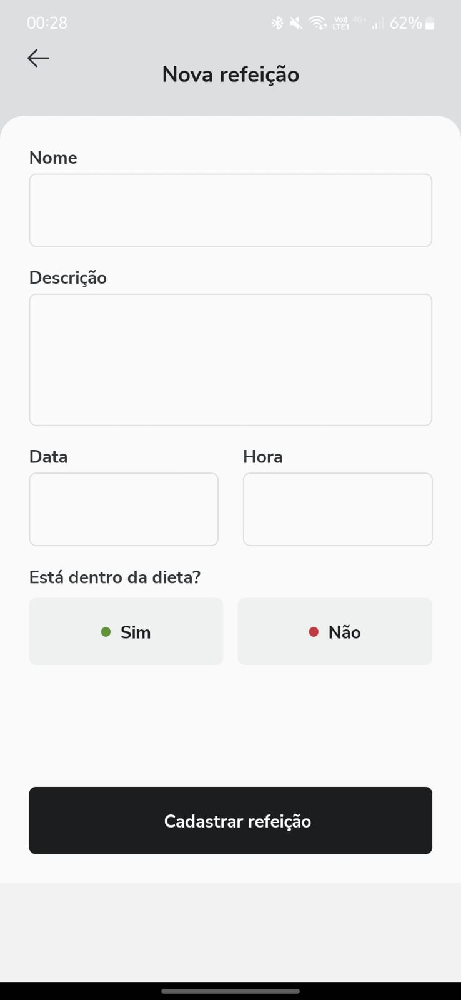

Dieta

> The present project is an App expo managed with a list of tasks using `navigation` e `async storage`. The App covers create, update and delete meals.
<div>
  <p  align="center">
  
  
  
  
  
  
  

</p>
</div>
The project is still under development and the next updates will focus on the following tasks:

- ✅Creating a New Meal
- ✅Toggle if the meal is in diet
- ✅Update meal's data
- ✅Delete a meal
- ✅Save data using AsyncStorage
- ⌛Choose a photo by your gallery using AsyncStorage

- ## ⚙️ Install

For the installation of the project, follow the steps:

Clone the project:

```
https://github.com/SamuelBarbosa1/Dieta
```

Go to project path:

```
cd Dieta
```

Run the command to install all packages:

```
npm install
```

## 🚀 Running the App

After installing the packages just run the command:

```
npx expo start
```
* ## :wrench: technologies used
<div>
   
  
  

</div>
